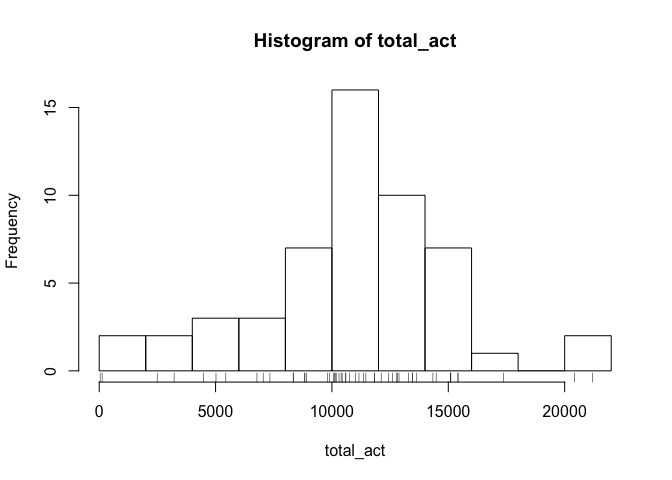
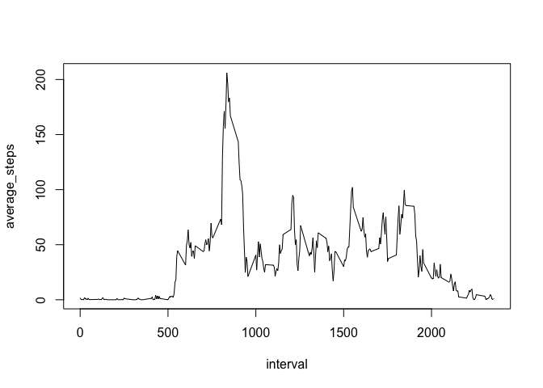
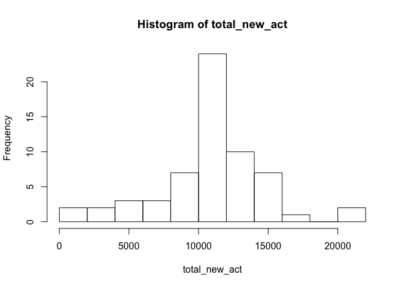
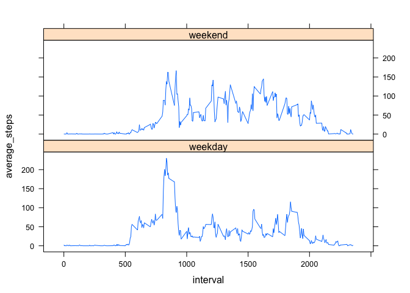

## Loading and preprocessing the data

first step is unzipping the archive and reading the csv file into *act* data frame (make sure the zip file *activity.zip* is in the working directory)


```r
unzip("activity.zip")
act <- read.csv("activity.csv")
options(scipen = 1, digits = 2) # sets the format of the numerics in report's outputs
```

here is a preview of the dataset


```r
head(act)
```

```
##   steps       date interval
## 1    NA 2012-10-01        0
## 2    NA 2012-10-01        5
## 3    NA 2012-10-01       10
## 4    NA 2012-10-01       15
## 5    NA 2012-10-01       20
## 6    NA 2012-10-01       25
```

## What is mean total number of steps taken per day?

for this step, we filter out the NAs from *steps* variable and save the new data frame *clean_act*. Then total steps per day are calculated and saved as *total_act*.


```r
library(dplyr)
clean_act <- droplevels(filter(act, !is.na(act$steps)))
total_act <- tapply(clean_act$steps, clean_act$date, sum)
```

here is a histogram of the total number of steps taken each day


```r
hist(total_act, breaks = 8)
rug(total_act)
```

<!-- -->

the mean and median total number of steps taken per day are calculated as follows


```r
mean_act <- mean(total_act)
median_act <- median(total_act)
```

therefore, the **mean value** is 10766.19 and the **median value** is 10765

## What is the average daily activity pattern?

in order to assess average daily activity pattern, we first calculate the average number of steps taken at each interval, averaged across all days; the resulting data frame needs to be reshaped to have interval as x and average steps as y, using melt function. Then we plot y vs. x.


```r
library(reshape2)
int_act <- tapply(clean_act$steps, clean_act$interval, mean)
int_act2 <- melt(int_act, varnames = "interval", value.name = "average_steps")
with(int_act2, plot(interval, average_steps, type="l"))
```

<!-- -->

the 5-minute interval, which (on average across all the days in the dataset) contains the maximum number of steps is calculated easily


```r
int_max <- int_act2[which.max(int_act2$average_steps), 1]
```

...and is equal to 835.

## Imputing missing values


```r
na_sum <- sum(is.na(act$steps))
na_perc <- mean(is.na(act$steps))*100
```

the total number of missing values in the dataset (i.e. the total number of rows with NAs) is 2304. That is 13.11 % of the total readings in this dataset!

all of the missing values in the dataset were filled in using he mean for the corresponding 5-minute interval. The new dataset is called *new_act*.


```r
new_act <- act
for (i in 1:nrow(new_act)) {
        if (is.na(new_act$steps[i])) {
                new_act$steps[i] = int_act2$average_steps[which(int_act2$interval == new_act$interval[i])]
        }
}
```

similar to the *act* dataset, the total number of steps taken each day and the mean and median total number of steps taken per day were calculated


```r
total_new_act <- tapply(new_act$steps, new_act$date, sum)
mean_new_act <- mean(total_new_act)
median_new_act <- median(total_new_act)
```

here is a histogram of the total number of steps taken each day for *new_act*


```r
hist(total_new_act, breaks = 8)
```

<!-- -->

the mean 10766.19 and median value 10766.19 for the new dataset, are almost equal to the corresponding values for *act*. The only impact of imputing missing data on the estimates of the total daily number of steps seems to be an increase in frequency of days with mean/median total daily steps.


## Are there differences in activity patterns between weekdays and weekends?

in order to assess the activity patters between weekdays and weekends, a new factor variable (day_type) was created in the dataset with two levels -- "weekday" and "weekend" indicating whether a given date is a weekday or weekend day. The average number of steps taken, averaged across all weekday days or weekend days, then obtained using this factor levels and saved in *wkd_act*, and then re-shaped to have suitable x y variables for plotting.


```r
weekday = c("Monday", "Tuesday", "Wednesday", "Thursday", "Friday")
weekend = c("Saturday", "Sunday")
levels = c('weekday', 'weekend')
d_type <- factor(levels)

new_act$day_type <- d_type[1]
for (i in 1:nrow(new_act)) {
        if (weekdays(as.Date(new_act$date[i])) %in% weekday) {
                new_act$day_type[i] <- d_type[1]
        } else {
                new_act$day_type[i] <- d_type[2]
        }
}

wkd_act <- tapply(new_act$steps, list(new_act$interval, new_act$day_type), mean)
final_act <- melt(wkd_act, varnames = c('interval', 'day_type'), value.name = 'average_steps')
```

here is a time series plot (i.e. type = "l") of the 5-minute interval (x-axis) and the average number of steps taken, averaged across all weekday days or weekend days (y-axis).


```r
library(lattice)
xyplot(average_steps ~ interval | day_type, data = final_act, layout = c(1,2), type = "l")
```

<!-- -->
